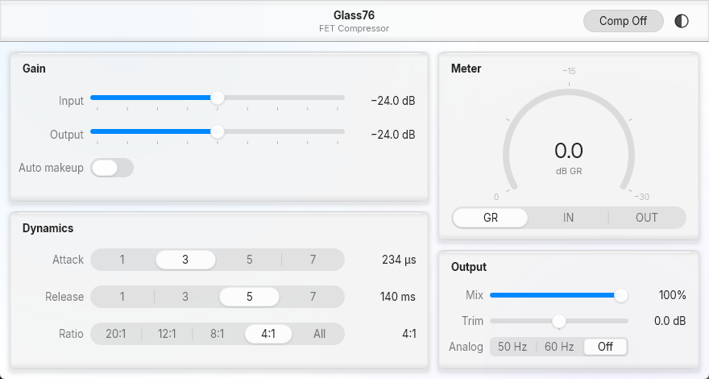
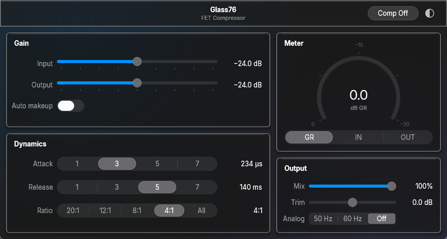

# Glass76

A 1176-style FET compressor VST3 for FL Studio on Windows, with a macOS 27
("Liquid Glass") interface drawn from Apple's own UI kit metrics.

MIT licensed. Windows x64 only.



## Install

Grab `Glass76-<version>-win64.exe` from the
[latest release](https://github.com/jxxnmade/Glass76_github_repo/releases/latest) and run it. It
installs to `C:\Program Files\Common Files\VST3\Glass76.vst3`, adds an entry to
Apps & features, and uninstalls cleanly.

The installer is **not code-signed**, so SmartScreen shows *"Windows protected
your PC"* the first time. *More info* → *Run anyway*. Signing needs a
certificate that costs money and is tied to a legal identity; this project has
neither.

In FL Studio: Options → Manage plugins → **Find installed plugins**, with
*Rescan previously verified plugins* ticked.

Prefer to drop the bundle in yourself? The release also carries
`Glass76-vst3-bundle.zip` — unzip `Glass76.vst3` into any folder your host
scans.

## Build

```powershell
git clone https://github.com/jxxnmade/Glass76_github_repo
cd glass76
.\scripts\build.ps1 -FetchSdk -Validate -Test -Install
```

`-FetchSdk` clones the VST 3 SDK (about 1 GB, once); drop it if you already
have one. `-Install` needs an elevated shell. Full instructions, options and
troubleshooting are in [docs/BUILDING.md](docs/BUILDING.md).

Close FL Studio before rebuilding — while it is open it holds the DLL and the
install copy fails.

## Controls

| # | Control | Type | Values |
|---|---|---|---|
| 1 | Input | 9-detent slider | −∞, −48, −36, −30, −24, −18, −12, −6, 0 dB |
| 2 | Output | 9-detent slider | same |
| 3 | Auto makeup | switch | on / off |
| 4 | Attack | segmented | positions 1, 3, 5, 7 |
| 5 | Release | segmented | positions 1, 3, 5, 7 |
| 6 | Ratio | segmented | 20:1, 12:1, 8:1, 4:1, All |
| 7 | Meter | segmented | GR, IN, OUT |
| 8 | Comp Off | toolbar toggle | on / off |
| 9 | Analog | segmented | 50 Hz, 60 Hz, Off |
| 10 | Mix | slider | 0–100 % |
| 11 | Trim | bipolar slider | −18…+18 dB |

Plus the VST3 `Bypass` parameter, which the host owns and draws itself, and
three read-only meter parameters the processor uses to feed the gauge.

## Decisions worth knowing about

**Attack and Release are knob positions, not milliseconds.** The panel numbers
1/3/5/7 are the positions printed on an 1176's stepped pots, and the plug-in
maps them to the hardware's actual times: attack 800 µs at position 1 down to
20 µs at 7, release 1100 ms down to 50 ms, interpolated logarithmically. The
resolved time is shown in the value column next to each control. If literal
1/3/5/7 ms was wanted instead, change `attackPositionToSeconds` and
`releasePositionToSeconds` in `source/params.h` — nothing else needs to move.

**Gain staging.** Input and Output are attenuators, like the hardware: the
amplifier gain that follows them is fixed (+24 dB each, `kInputMakeupDb` /
`kOutputMakeupDb`) and the threshold is fixed at −18 dBFS. So the **−24 dB
detent on both is unity gain**, and a −18 dBFS signal sits exactly on the
threshold. Turning Input up drives the compressor harder; Input at −∞ mutes,
which is what the real control does.

**All buttons in.** The fifth ratio position is the "British mode": nominal
20:1, threshold dropped 8 dB, knee widened to 12 dB, attack lagged, release
sped up, and the FET driven 2.2× harder.

**Comp Off** disables gain reduction only. Input/Output gain, the analog
emulation, mix and trim all still apply, and the meter reads zero reduction.

**Analog** injects mains hum (−78 dBFS composite, fundamental plus 2nd and 3rd)
and a −96 dBFS noise floor *before* the detector, so they behave like real
circuit noise and get compressed with the signal.

**Meters** travel from processor to UI as three read-only VST3 parameters
pushed through `data.outputParameterChanges`. That is allocation-free on the
audio thread — no `IMessage`, no shared pointers between processor and
controller.

## The interface

Targets **macOS 27**, not Aqua. Every value is traced to a measurement of
Apple's published macOS 27 UI kit, and the tokens all live in
`source/ui/theme.h`. The two systems disagree on window background, control
sizes, radii, accent colour and label alphas, so none of the Aqua tables are
used here.

- White (`#FFFFFF`) / `#1E1E1E` window background, 12pt content inset, 52pt
  unified toolbar, group boxes at radius 12.
- Five size classes with radius = height ÷ 4; capsules for switches, sliders
  and the Lg segmented controls.
- 0.6 corner smoothing as a superellipse above 8px radius — but **not** on
  capsules, whose ends are true semicircles.
- Accent `#0088FF` / `#0091FF`, six label levels as alpha over the backdrop.
- The Liquid Glass edge stack on every panel: dark inner bands top and bottom
  *before* the specular hairline, lateral edge lights with x-offsets, then the
  containment ring. Controls sitting on glass use the over-glass fill set.
- Idle / Clicked / Disabled only. macOS 27 has no hover state for these
  control families, so neither does this.
- Light and dark, toggled from the appearance button in the toolbar and stored
  in the controller's own state (never exposed as an automatable parameter).



Two deliberate departures, both because a plug-in window is not a macOS window:

1. **No traffic lights.** The host owns the window chrome; non-functional ones
   would be a lie.
2. **The wallpaper is faked.** Glass has nothing to sample behind a plug-in
   window, so two very faint radial washes stand in for the wallpaper bleed a
   real macOS 27 window picks up. Without them the glass panels disappear into
   the white background.

**Fonts.** SF Pro is licensed for Apple platforms and cannot ship in a Windows
binary. Inter is the licensed substitute and **ships inside the bundle** --
`resource/Fonts/` holds Inter and Inter Display (Regular + Bold) plus the OFL
licence, and CMake copies them into `Contents/Resources/Fonts`, which VSTGUI
adds to a private DirectWrite collection at start-up. Nothing has to be
installed system-wide. `mac::Fonts::get()` resolves the text and display
optical sizes separately -- Inter Display for 20px and up, Inter below -- and
records what actually resolved, because a font that silently falls back breaks
every metric while nothing errors.

> **Upstream VSTGUI bug, worked around in `ui/macdraw.cpp`.** Bundled fonts do
> not load in *any* VST3 plug-in as shipped. `setupVSTGUIBundleSupport()` passes
> `Win32Factory::setResourceBasePath()` a path with no trailing separator
> (`...\Contents\Resources`). `setBasePath()` normalises it for resource
> loading, but the **raw** string is what reaches `D2DFont::initialize()`, which
> appends `"Fonts\*"` -- giving `...\Contents\ResourcesFonts\*`. That
> directory does not exist, the scan returns nothing, and the custom font
> collection is empty with no error reported anywhere. Reading the path back
> yields the normalised form and setting it again re-runs the scan against the
> right directory. Verified: font enumeration goes from 205 families (no Inter)
> to 207 (Inter, Inter Display).

## Layout

```
source/params.h          parameter IDs, tables, and every plain<->normalized
                         conversion, shared by processor and controller
source/processor.*       the DSP. Feed-forward peak-sensing FET compressor
source/controller.*      parameter definitions, state mirror, VST3EditorDelegate
source/ui/theme.h        macOS 27 tokens, light and dark
source/ui/macdraw.*      squircle paths, the glass edge stack, shadows, fonts
source/ui/editor.*       RootView: the whole editor, laid out and painted
resource/glass76.uidesc  a one-view template; RootView is substituted into it
resource/Fonts/          Inter + Inter Display, shipped in the bundle
tools/offline_test.cpp   offline host that checks the DSP against the binary
scripts/build.ps1        configure, build, validate, test, install
installer/Glass76.nsi    the Windows installer
docs/BUILDING.md         toolchain, SDK, CMake options, troubleshooting
```

The VST 3 SDK is not vendored here — CMake locates or clones a checkout at
build time. See [docs/BUILDING.md](docs/BUILDING.md).

## Tests

The SDK validator covers the plug-in contract; the offline host covers the DSP.

```powershell
.\scripts\build.ps1 -Validate -Test
```

The offline host loads the *built bundle* rather than linking against the same
sources, so a missing `.uidesc` or a font that did not get copied fails there
too. It checks unity calibration, that 4:1 at 12 dB over threshold gives ~9 dB
of reduction, that 20:1 reduces more, Comp Off, auto make-up, Mix at 0 %, Trim
±6 dB, the −∞ and 0 dB attenuator detents, the analog hum floor, and the meter
round trip.

Current status: **validator 47/47, offline host 17/17**, from a clean rebuild.
CI runs both on every push.

Not yet verified: behaviour inside FL Studio itself, and rendering at 125 % /
150 % display scaling. Reports on either are welcome.

## Contributing

See [CONTRIBUTING.md](CONTRIBUTING.md). Two rules that matter more than style:
the class IDs in `source/cids.h` never change, and nothing on the audio thread
allocates, locks, or logs.

## Licence

Glass76 is MIT licensed — [LICENSE](LICENSE).

It links the VST 3 SDK and VSTGUI, and ships the Inter typeface inside its
bundle. Those carry their own terms, and binary redistributions have to
reproduce two of them: see [THIRD-PARTY-NOTICES.md](THIRD-PARTY-NOTICES.md),
which the installer copies alongside the plug-in.

VST is a registered trademark of Steinberg Media Technologies GmbH. macOS and
SF Pro are trademarks of Apple Inc. This project is affiliated with neither
company, and contains no Apple code, artwork, or fonts.
